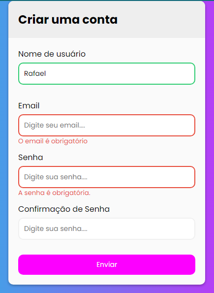

# Criação de um formulário 
### Um formulário com validação em todos os campos
### Mensagem de erro e sucesso inclusas, para preenchimento correto em cada campo
### Senha de acesso com 7 caracteres 
### Inclusão de mensagens de erro 
# Aparência do formulário
 

# Imagens de erro, e email obrigatório

